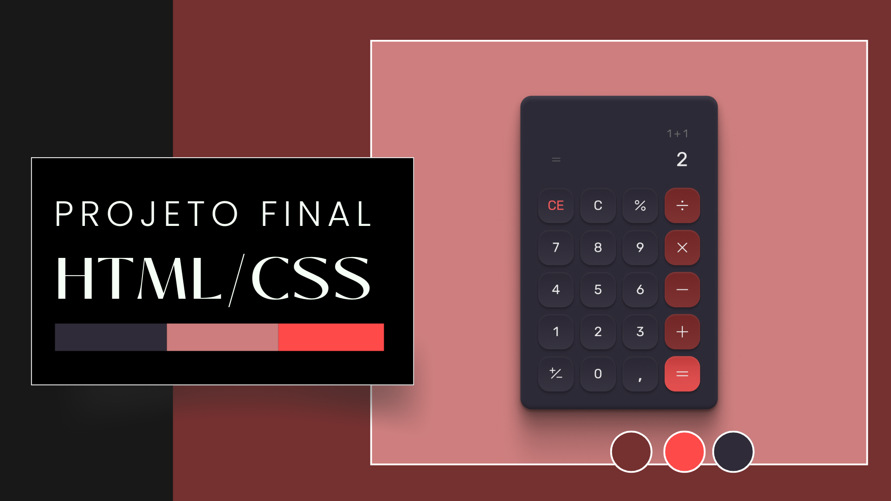

 

## 🖥️ Projeto

Esse é um projeto final Web desenvolvido pelos alunos Giovanna Bandeira e Erick Maia durante o curso de Dev Fullstack da Infinity School, sob a mentoria do professor Luan Oliveira.

### 🔎 Tecnologias

Esse projeto foi desenvolvido com as seguintes tecnologias:

- HTML
- CSS
- Github

## 🎨 Layout

Você pode visualizar o layout do projeto através
[desse link](https://www.figma.com/file/JkJzlMrZ9sIm7JZZgwwp7L/Calculadora?type=design&node-id=0%3A1&mode=design&t=dQx1ClULG0VYqTa9-1
).
É necessario ter uma conta no [Figma](https://www.figma.com).

### 🧑‍💻 Creditos

Projeto feito em sala da [Infinity School](https://infinityschool.com.br/).

Professor [Luan Oliveira](https://www.linkedin.com/in/luanpdd/).